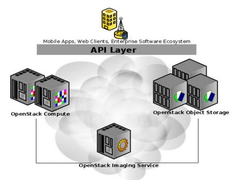
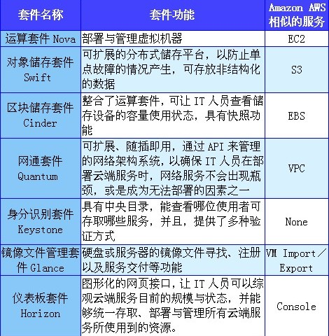

# OpenStack vs OpenNebula #

####OpenSource008： 
&emsp;&emsp;&emsp;&emsp;&emsp;&emsp;&emsp;&emsp;&emsp;&emsp;丁林斌 HarrisonDing

&emsp;&emsp;&emsp;&emsp;&emsp;&emsp;&emsp;&emsp;&emsp;&emsp;韦润酥 Thinkfly

## 项目介绍 ##
####OpenStack 介绍####

&emsp;&emsp;OpenStack 是由 Rackspace 和 NASA 共同开发的云计算平台,旨在为公共及私有云的建设与管理提供软件的开源项目，它的首要任务是简化云的部署并为其带来良好的可扩展性。 该项目以Apache许可证授权，并且是一个自由软件和开放源代码项目。 目前它的社区拥有超过130家企业及1350位开发者，这些机构与个人都将OpenStack作为基础设施即服务（简称IaaS）资源的通用前端。

&emsp;&emsp;OpenStack由几个主要的组件组合起来完成一些具体的工作，包括OpenStack Compute (Nova)， OpenStack Object Storage (Swift)和OpenStack Image Service (Glance). 关系如下图，

&emsp;&emsp;部件及关系如下说明，

&emsp;&emsp;OpenStack Compute，为云组织的控制器，它提供一个工具来部署云，包括运行实例、管理网络以及控制用户和其他项目对云的访问(thecloudthroughusersandprojects)。它底层的开源项目名称是Nova，其提供的软件能控制IaaS云计算平台，类似于AmazonEC2和RackspaceCloudServers。实际上它定义的是，与运行在主机操作系统上潜在的虚拟化机制交互的驱动，暴露基于WebAPI的功能。

&emsp;&emsp;OpenStack Object Storage，是一个可扩展的对象存储系统。对象存储支持多种应用，比如复制和存档数据，图像或视频服务，存储次级静态数据，开发数据存储整合的新应用，存储容量难以估计的数据，为Web应用创建基于云的弹性存储。

&emsp;&emsp;OpenStackImageService，是一个虚拟机镜像的存储、查询和检索系统，服务包括的RESTfulAPI允许用户通过HTTP请求查询VM镜像元数据，以及检索实际的镜像。VM镜像有四种配置方式：简单的文件系统，类似OpenStackObjectStorage的对象存储系统，直接用Amazon'sSimpleStorageSolution(S3)存储，用带有ObjectStore的S3间接访问S3。

####OpenNebula 介绍####
&emsp;&emsp;OpenNebula是一个用于管理各种各样分布式数据中心基础设施的云计算工具包， 是一个自由软件和开发源代码的软件，以Apache v2许可授权。 可以用来构建私有云，公有云和混合云，并提供独特的云管理特性，并且还保持与构建内部云需要的其他IT厂商集成兼容性。 工具包包含集成，管理，可扩展性，安全性和会计的功能，并以一种标准化，互操作性和便携性的特色，提供用户和管理员多种可选择的云接口。根据分配策略，结合数据中心资源和远程的云资源， 在虚拟基础设施上以虚拟机形式精心编排存储，网络，虚拟化，监测和安全技术部署多级服务。 

&emsp;&emsp;OpenNebula由C12G赞助， 已被主机供应商，电信运营商，IT 服务提供商，超级计算中心，研究实验室和国际研究项目使用， 其他一些云解决方案使用OpenNebula作为云引擎或内核服务。

&emsp;&emsp;OpenNebula的构架包括三个部分： 驱动层、核心层、工具层，架构如下图，
 

&emsp;&emsp;驱动层直接与操作系统打交道，负责虚拟机的创建、启动和关闭，为虚拟机分配存储，监控物理机和虚拟机的运行状况。  

&emsp;&emsp;核心层负责对虚拟机、存储设备、虚拟网络等进行管理。  

&emsp;&emsp;工具层通过命令行界面/浏览器界面方式提供用户交互接口，通过API方式提供程序调用接口。

## 功能比较 ##
####OpenStack####
&emsp;&emsp;云操作系统OpenStack是由好几个不同的功能套件所构成的开源云软件，目前共有7个功能不同的套件，分别是运算套件Nova、对象储存套件Swift、区块储存套件Cinder、网通套件Quantum、身分识别套件Keystone、镜像文件管理套件Glance、提供管理接口的仪表板套件Horizon。就云服务的架构来看，其中又以运算套件、网通套件以及储存套件最为重要。
&emsp;&emsp;企业若是想要使用OpenStack打造云端服务，并非每个套件都必须使用，企业可挑选现阶段没有的管理套件即可，像是全球第8大的在线零售商MercadoLibre使用了运算套件Nova、对象储存套件Swift、镜像文件管理套件Glance，来打造自家PaaS私有云。
&emsp;&emsp;OpenStack每个版本都有不同的名称。在2010年10月，OpenStack第一版诞生，名为Austin，而在这个版本，仅有运算套件Nova与对象储存套件Swift。
随着OpenStack发展，各领域厂商加入，不同的套件推陈出新，陆续被加入在新的版本内。目前最新版名为Grizzly，就包含了上述的7个套件，并还有2个套件刚刚开发完成，分别是Orchestration层整合套件Heat，以及数据监控套件Ceilometer。

1、运算套件Nova
&emsp;&emsp;Nova套件主要提供部署与管理虚拟机器的功能。工程师可利用API开发云端应用程序，而IT管理人员则可透过网页式的接口查看或管理硬件资源运作的状况，并可重起、暂停、调整，甚至直接关闭虚拟机器。
&emsp;&emsp;IT人员可将Nova套件部署在多家厂商的虚拟化平台上，目前来说，以KVM和Xen虚拟化平台最为稳定。除了支持不同的虚拟化平台之外，在硬件架构的部份，OpenStack支持x86架构、ARM架构等。另外，Nova套件还支持Linux轻量级的虚拟化技术LXC，能够再切割虚拟机器，分出更多的虚拟化执行环境。  
&emsp;&emsp;此外，Nova套件还具有管理LAN网络的功能，可程序化的分配IP地址与VLAN，快速部署网络与资安功能。Nova套件还可将某几台虚拟机器设为群组，和不同群组作隔离，并有基于角色的访问控制（RBAC）功能，可根据使用者的角色确保可存取的资源为何。

2、对象储存套件Swift
&emsp;&emsp;Swift套件提供可扩展的分布式储存平台，以防止单点故障的情况产生。使用者可透过API进行存取，可存放非结构化的数据，像是图像、网页、网志等，并可作为应用程序数据备份、归档以及保留之用。
&emsp;&emsp;透过Swift套件，可让业界标准的设备存放PB等级的数据量。而且，当新增服务器后，储存群集可轻易的横向扩充。
&emsp;&emsp;此外，因为Swift套件是透过软件的逻辑，确保数据被复制与分布在不同设备上，这可让企业使用较便宜的设备，节省成本。

3、区块储存套件Cinder
&emsp;&emsp;Cinder套件允许区块储存设备能够整合商业化的企业储存平台，像是NetApp、Nexenta、SolidFire等。区块储存系统可让IT人员设置服务器和区块储存设备的各项指令，包括建立、连接和分离等，并整合了运算套件，可让IT人员查看储存设备的容量使用状态。
&emsp;&emsp;Cinder套件并提供快照管理功能，可保护虚拟机器上的数据，作为系统回复时所用，快照甚至可用来建立一个新的区块储存容量。

4、网通套件Quantum
&emsp;&emsp;Quantum套件是个可扩展、随插即用，透过API来管理的网络架构系统，确保IT人员在部署云端服务时，网络服务不会出现瓶颈，或是成为无法部署的因素之一。
&emsp;&emsp;Quantum套件支持众多网通厂商的技术，IT人员可配置IP地址，分配静态IP或是动态IP。而且，IT人员可使用SDN技术，像是OpenFlow协议来打造更大规模或是多租户的网络环境。
&emsp;&emsp;此外，允许部署和管理其它网络服务，像是入侵侦测系统（IDS）、负载平衡、防火墙、VPN等。

5、身分识别套件Keystone
&emsp;&emsp;Keystone套件作为OpenStack的身分认证系统，具有中央目录，能查看哪位使用者可存取哪些服务，并且，提供了多种验证方式，包括使用者账号密码、Token（令牌）以及类似AWS的登入机制。另外，Keystone可以整合现有的中央控管系统，像是LDAP。

6、镜像文件管理套件Glance
&emsp;&emsp;Glance套件提供提供硬盘或服务器的镜像文件寻找、注册以及服务交付等功能。储存的镜像文件可作为新服务器部署所需的范本，加快服务上线速度。若是有多台服务器需要配置新服务，就不需要额外花费时间单独设置，也可做为备份时所用。

7、仪表板套件Horizon
&emsp;&emsp;Horizon套件提供IT人员一个图形化的网页接口，让IT人员可以综观云端服务目前的规模与状态，并且，能够统一存取、部署与管理所有云端服务所使用到的资源。
&emsp;&emsp;Horizon套件是个可扩展的网页式App。所以，Horizon套件可以整合第3方的服务或是产品，像是计费、监控或是额外的管理工具。

8、业务流程平台Heat
&emsp;&emsp;这是一套，旨在帮助用户更轻松地配置以OpenStack为基础的云体系。利用Heat应用程序，开发人员能够在程序中使用模板以实现资源的自动化部署。根据项目管理者的说法，Heat能够启动应用、创建虚拟机并自动处理整个流程。它还拥有出色的跨平台兼容性，能够与Amazon Web Services业务流程平台CloudFormation相对接——这意味着用户完全可以将AWS模板引入OpenStack环境当中。

9、收集使用数据的服务Ceilometer
&emsp;&emsp;这是一项专门从OpenStack云环境中收集使用数据的服务。它集成了OpenStack的验证与身份管理系统，从而实现更为细化的数据追踪效果，其中包括哪位用户正在使用哪些资源、具体使用时长是多少等。为了满足服务供应商的需要，它还提供自动计费功能。

####OpenNebula####
&emsp;&emsp;ONE 不同以存的 VM Manager，在于高模块化和开放的架构去符合 cluster 管理者的需求，最新版可支持 XEN 和 KVM，还有以下特色和功能：
&emsp;&emsp;&emsp;&emsp;1、有效的资源管理
&emsp;&emsp;&emsp;&emsp;2、强大的接口 (提供 API 和 CLI 来监控或控制 VMs 和实体机器)
&emsp;&emsp;&emsp;&emsp;3、第三方的软件整合
&emsp;&emsp;&emsp;&emsp;4、开放和弹性的架构
&emsp;&emsp;&emsp;&emsp;5、容错机制
&emsp;&emsp;&emsp;&emsp;6、印象檔的管理
&emsp;&emsp;&emsp;&emsp;7、网络管理
&emsp;&emsp;&emsp;&emsp;8、稳定和可扩称性
&emsp;&emsp;&emsp;&emsp;9、根据服务工作量的需求 scale
&emsp;&emsp;&emsp;&emsp;10、简单的安装和管理
&emsp;&emsp;&emsp;&emsp;11、开放原始码
#####4.0新特性#####
&emsp;&emsp;一、OpenNebula Core：
&emsp;&emsp;1. VM System Snapshots
&emsp;&emsp;虚拟机系统快照是指整个virtual machine的全状态的快照，即memory+disk的快照，这个features目前仅支持KVM和VMWare
&emsp;&emsp;2. Disk Snapshots
&emsp;&emsp;磁盘快照的改进，与OpenNebula 3.8相比，4.0支持在线的磁盘快照（live snapshot of disk），注意：需要应用程序来保证文件系统数据的一直性
&emsp;&emsp;3. capacity re-sizing
&emsp;&emsp;重新虚拟机资源配置的能力，比如调整virtual machine的cpu和memory等资源的配置，注意：此调整只能在离线的情况下进行
&emsp;&emsp;4. programmable VM operations
&emsp;&emsp;可编程的virtual machine operations，比如可以指定在周五16:00关闭某个virtual machine，然后在下周一9:00启动此virtual machine
&emsp;&emsp;5. NIC hotplugging
&emsp;&emsp;支持网卡的热插拔，动态的增加virtual machine的网卡设备
&emsp;&emsp;6. IPv6 supporting
&emsp;&emsp;7. Plain file datastore
&emsp;&emsp;增加支持常规文件的datastore，增加一种特殊类型的datastore用来存储kernel，ramdisk以及其他文件，将来在生成virtual machine的context时使用，另外，还增加了响应的访问控制的功能
&emsp;&emsp;8. user defined VM tags
&emsp;&emsp;9. Powerful CLI
&emsp;&emsp;二、OpenNebula Administrator Interface：
&emsp;&emsp;1. syslog support
&emsp;&emsp;增加系统日志的功能，用来记录oned进程和scheduler进程的日志信息
&emsp;&emsp;2. ACLs for Cluster
&emsp;&emsp;对cluster的更细粒度的访问控制功能
&emsp;&emsp;3. Default Quotas     
&emsp;&emsp;默认的配额管理功能，用来限制各种虚拟资源的使用
&emsp;&emsp;4. Efficient Monitoring
&emsp;&emsp;更有效的监控管理，大大的降低了监控的延迟和由监控带来的性能开销
&emsp;&emsp;5. VM Cancellation and clean-up synchronization
&emsp;&emsp;虚拟机取消和销毁操作的同步bug的解决，之前版本中，虚拟机的cancel and destroy operation操作是asynchronous，现在变成同步的，destroy operation必须等待cancel operation完成
&emsp;&emsp;6. 高并发的网络驱动
&emsp;&emsp;消除了在同一个host上创建多个vm时，网络是瓶颈的问题，即优化了网络驱动，可以高并发的在同一个host上创建多个vm。
&emsp;&emsp;三、OpenNebula Drivers
&emsp;&emsp;1. Authentication Drivers
&emsp;&emsp;更好的认证管理的驱动
&emsp;&emsp;2. Virtualization Drivers
&emsp;&emsp;&emsp;&emsp;（1）更好的支持Xen 3 and Xen 4，原生的支持，不再需要通过适配器（adapter）支持
&emsp;&emsp;&emsp;&emsp;（2）对KVM增加了一些新的特性，比如disk cache和DISK IO相关的属性
&emsp;&emsp;&emsp;&emsp;（3）Custom attributes for VMware VMX files
&emsp;&emsp;3. Storage Drivers
&emsp;&emsp;&emsp;&emsp;（1）优化了iscsi driver，提高了tgt server的并发性
&emsp;&emsp;&emsp;&emsp;（2）增加了cephdatastore
&emsp;&emsp;4. Scheduler
&emsp;&emsp;&emsp;&emsp;（1）Cluster attributes for VM placement，增加了虚拟机分配时的集群属性，可以在调度算法的requirements和rank中增加cluster和host相关的属性，可以更方便的标记属于一个cluster的所有主机
&emsp;&emsp;&emsp;&emsp;（2）Affinity Policies，亲和策略，增加一个特殊的变量CURRENT_VMS，用来指定将要调度的虚拟机分配到与CURRENT_VMS指定的虚拟机有关系的host上，比如CURRENT_VMS=5，即将要调度的虚拟机调度到运行有虚拟机5的host上，CURRENT_VMS！=5，即没有运行虚拟机5的hosts上
&emsp;&emsp;&emsp;&emsp;（3）Any host attribute for scheduling expressions
&emsp;&emsp;&emsp;&emsp;（4）Scheduler feedback through VM tags
&emsp;&emsp;调度反馈信息，如果被tag的某个vm调度失败了，会反馈失败信息。

## 其他比较 ##

## 结合自身需要评估后的结论 ##

## 组员贡献 ##

丁林斌： 项目介绍
韦润酥： 功能比较

## 参考资料 ##

References:

1. http://baike.baidu.com/view/4924215.htm
2. http://en.wikipedia.org/wiki/OpenStack
3. http://openstack.csdn.net/content.html?arcid=2808843
4. http://en.wikipedia.org/wiki/OpenNebula
5. http://opennebula.org/documentation:archives:rel2.0:architecture
6. http://www.qyjohn.net/?p=1263