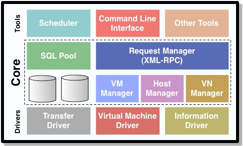

# OpenStack vs OpenNebula #

####OpenSource008： 
&emsp;&emsp;&emsp;&emsp;&emsp;&emsp;&emsp;&emsp;&emsp;&emsp;丁林斌 HarrisonDing      

## 项目介绍 ##
####OpenStack 介绍####

&emsp;&emsp;OpenStack 是由 Rackspace 和 NASA 共同开发的云计算平台,旨在为公共及私有云的建设与管理提供软件的开源项目，它的首要任务是简化云的部署并为其带来良好的可扩展性。 该项目以Apache许可证授权，并且是一个自由软件和开放源代码项目。 目前它的社区拥有超过130家企业及1350位开发者，这些机构与个人都将OpenStack作为基础设施即服务（简称IaaS）资源的通用前端。

&emsp;&emsp;OpenStack由几个主要的组件组合起来完成一些具体的工作，包括OpenStack Compute (Nova)， OpenStack Object Storage (Swift)和OpenStack Image Service (Glance). 关系如下图，

&emsp;&emsp;部件及关系如下说明，

&emsp;&emsp;OpenStack Compute，为云组织的控制器，它提供一个工具来部署云，包括运行实例、管理网络以及控制用户和其他项目对云的访问(thecloudthroughusersandprojects)。它底层的开源项目名称是Nova，其提供的软件能控制IaaS云计算平台，类似于AmazonEC2和RackspaceCloudServers。实际上它定义的是，与运行在主机操作系统上潜在的虚拟化机制交互的驱动，暴露基于WebAPI的功能。

&emsp;&emsp;OpenStack Object Storage，是一个可扩展的对象存储系统。对象存储支持多种应用，比如复制和存档数据，图像或视频服务，存储次级静态数据，开发数据存储整合的新应用，存储容量难以估计的数据，为Web应用创建基于云的弹性存储。

&emsp;&emsp;OpenStackImageService，是一个虚拟机镜像的存储、查询和检索系统，服务包括的RESTfulAPI允许用户通过HTTP请求查询VM镜像元数据，以及检索实际的镜像。VM镜像有四种配置方式：简单的文件系统，类似OpenStackObjectStorage的对象存储系统，直接用Amazon'sSimpleStorageSolution(S3)存储，用带有ObjectStore的S3间接访问S3。

####OpenNebula 介绍####
&emsp;&emsp;OpenNebula是一个用于管理各种各样分布式数据中心基础设施的云计算工具包， 是一个自由软件和开发源代码的软件，以Apache v2许可授权。 可以用来构建私有云，公有云和混合云，并提供独特的云管理特性，并且还保持与构建内部云需要的其他IT厂商集成兼容性。 工具包包含集成，管理，可扩展性，安全性和会计的功能，并以一种标准化，互操作性和便携性的特色，提供用户和管理员多种可选择的云接口。根据分配策略，结合数据中心资源和远程的云资源， 在虚拟基础设施上以虚拟机形式精心编排存储，网络，虚拟化，监测和安全技术部署多级服务。 

&emsp;&emsp;OpenNebula由C12G赞助， 已被主机供应商，电信运营商，IT 服务提供商，超级计算中心，研究实验室和国际研究项目使用， 其他一些云解决方案使用OpenNebula作为云引擎或内核服务。

&emsp;&emsp;OpenNebula的构架包括三个部分： 驱动层、核心层、工具层，架构如下图，
 

&emsp;&emsp;驱动层直接与操作系统打交道，负责虚拟机的创建、启动和关闭，为虚拟机分配存储，监控物理机和虚拟机的运行状况。  

&emsp;&emsp;核心层负责对虚拟机、存储设备、虚拟网络等进行管理。  

&emsp;&emsp;工具层通过命令行界面/浏览器界面方式提供用户交互接口，通过API方式提供程序调用接口。

## 功能比较 ##

## 其他比较 ##

## 结合自身需要评估后的结论 ##

## 组员贡献 ##

丁林斌： 项目介绍

## 参考资料 ##

References:

1. http://baike.baidu.com/view/4924215.htm
2. http://en.wikipedia.org/wiki/OpenStack
3. http://openstack.csdn.net/content.html?arcid=2808843
4. http://en.wikipedia.org/wiki/OpenNebula
5. http://opennebula.org/documentation:archives:rel2.0:architecture
6. http://www.qyjohn.net/?p=1263